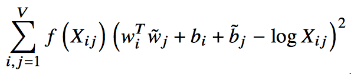

# Pytorch Global Vectors for Word Representation

[Global Vectors for Word Representation](nlp.stanford.edu/pubs/glove.pdf) implemented in [PyTorch](http://www.pytorch.org).



## Usage

```python
glove = GloVe(co_oc_matrix, embed_size)
    
optimizer = Adagrad(glove.parameters(), 0.05)
    
for i in range(num_iterations):
    ''' 
    input and target are [batch_size] shaped arrays of int type
    '''
    input, target = next_batch(batch_size)
        
    loss = glove(input, target)
    
    optimizer.zero_grad()
    loss.backward()
    optimizer.step()
    
word_embeddings = glove.embeddings()        
```